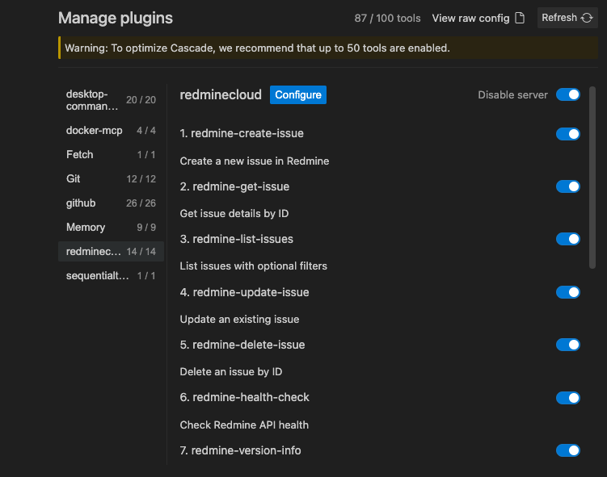

# Redmine MCP Server



<!-- test-status-badge -->\n[](https://github.com/zacharyelston/rrmcpy/actions)\n

[](https://github.com/zacharyelston/rrmcpy/actions)

A production-ready Python MCP Server for Redmine with a highly modular architecture designed to fight complexity, featuring comprehensive API management, robust error handling, and an extensible tool registry system.

## Features

- **Fighting Complexity Architecture**: Designed with separation of concerns and clear component boundaries
- **Comprehensive Issue Management**: Full CRUD operations with validation and error handling
- **Centralized Configuration**: Type-safe environment variable handling with validation
- **Tool Registry System**: Plugin-like architecture for extensible functionality
- **Robust Error Handling**: Standardized exceptions and consistent error responses
- **Production-Ready**: Health checking, logging, and connection management
- **Testability**: Dedicated testing module for automated validation

---

## Design Philosophy: Built for Clarity

The Redmine MCP Server is grounded in a single guiding principle: clarity over complexity. Every architectural and implementation decision aims to reduce unnecessary intricacy—making the system simpler, more understandable, and easier to maintain.

We believe the greatest challenge in software development isn’t adding features—it’s managing the complexity that comes with them.

**Key tenets of the Clarity-First approach include:**

- **Simplicity by Default**  
  Prioritize clear, straightforward solutions. Avoid convoluted logic, special cases, and needless abstractions.
- **Modular Architecture**  
  Break the system into small, focused components (e.g., ClientManager, ServiceManager, ToolRegistry) that can be understood, tested, and evolved independently.
- **Encapsulation**  
  Expose only what’s necessary via clear interfaces. Keep implementation details internal.
- **Solid Design Principles**  
  Apply proven patterns like SOLID, to ensure code is flexible, decoupled, and robust.
- **Practical Heuristics**  
  Use KISS, DRY, and YAGNI as guiding lights. Avoid overengineering and premature complexity.
- **Relentless Refinement**  
  Treat design as a living process. Refactor continuously to clarify, simplify, and improve.

By emphasizing clarity, the Redmine MCP Server stays nimble, stable, and developer-friendly—even as it scales. It means faster development, fewer bugs, and a system that grows without becoming a burden.

---

## Quick Start

### Prerequisites

- Redmine API key with appropriate permissions

### Using a .env File for Local Development

You can create a `.env` file in the project root to store environment variables for local development. Example:

```env
REDMINE_URL=https://your-redmine.com
REDMINE_API_KEY=your-api-key
SERVER_MODE=live
LOG_LEVEL=INFO
```

The server will automatically load these variables when running locally.

### Using Docker (Recommended)

1. Build the Docker image:
```bash
docker build -t redmine-mcp-server .
```

2. Run the server:
```bash
docker run -e REDMINE_URL=https://your-redmine.com -e REDMINE_API_KEY=your-api-key redmine-mcp-server
```

### Local Testing

Use the provided testing utilities:
```bash
# Interactive Docker testing menu
./test-docker.sh

# Test mode (validates configuration, tool registry, health check, and authentication)
python src/server.py --test

# Create real issue test
python scripts/test_create_real.py
```

### pyhton based loading
```{
  "mcpServers": {
    "redmine": {
      "command": "python",
      "args": ["/rrmcpy-path/src/server.py"],
      "env": {
        "REDMINE_URL": "https://your-redmine.com",
        "REDMINE_API_KEY": "your-api-key"
      }
    }
  }
}
### Environment Variables

- `REDMINE_URL`: URL of your Redmine instance (default: https://redstone.redminecloud.net)
- `REDMINE_API_KEY`: Your Redmine API key (required)
- `SERVER_MODE`: Server mode - 'live', 'test', or 'debug' (default: live)
- `LOG_LEVEL`: Logging level - 'DEBUG', 'INFO', 'WARNING', or 'ERROR' (default: INFO)

## Usage

The MCP server communicates using the MCP protocol over STDIO. It provides tools for Redmine API operations and integrates seamlessly with MCP clients like Claude Desktop.

### Available Tools (Canonical Inventory)

> **Note:** This inventory is auto-imported from the YAML specifications in [`docs/api_specifications/`](docs/api_specifications/). Checkboxes indicate implementation status and should be kept in sync with the codebase. For full method details, see the YAML files.

#### Project Management
- [ ] `listProjects`: Retrieves all projects accessible to the authenticated user
- [ ] `getProject`: Fetches detailed information for a specified project
- [ ] `createProject`: Creates a new project
- [ ] `updateProject`: Updates attributes of an existing project
- [ ] `archiveProject`: Archives a project
- [ ] `unarchiveProject`: Unarchives a project
- [ ] `deleteProject`: Deletes a project by its ID
- [ ] `listProjectMemberships`: Retrieves memberships for a project
- [ ] `addProjectMember`: Adds a user to a project with specified roles
- [ ] `removeProjectMember`: Removes a membership by its ID

#### User Management
- [ ] `listUsers`: Retrieves a list of users
- [ ] `getUser`: Fetches detailed information for a specified user
- [ ] `createUser`: Creates a new user account
- [ ] `updateUser`: Updates attributes of an existing user
- [ ] `deleteUser`: Deletes a user by its ID

#### Group Management
- [ ] `listGroups`: Retrieves all groups
- [ ] `getGroup`: Fetches detailed information for a specified group
- [ ] `createGroup`: Creates a new group
- [ ] `updateGroup`: Updates attributes of an existing group
- [ ] `deleteGroup`: Deletes a group by its ID
- [ ] `addUserToGroup`: Adds a user to a group
- [ ] `removeUserFromGroup`: Removes a user from a group

#### Issue Management
- [x] `listIssues`: Retrieves issues matching filter criteria
- [x] `getIssue`: Fetches detailed information for a specified issue
- [x] `createIssue`: Creates a new issue in a project
- [x] `updateIssue`: Updates fields of an existing issue
- [x] `deleteIssue`: Deletes an issue by its ID
- [ ] `addIssueComment`: Adds a journal entry (comment) to an issue
- [ ] `listIssueRelations`: Retrieves relations for a specified issue
- [ ] `createIssueRelation`: Creates a relation between two issues
- [ ] `deleteIssueRelation`: Deletes an issue relation by its ID
- [ ] `listTrackers`: Retrieves all issue trackers
- [ ] `listIssueStatuses`: Retrieves all issue statuses
- [ ] `listEnumerations`: Retrieves all enumerations
- [ ] `listIssueCategories`: Retrieves issue categories for a project

#### Document Management
- [ ] `listDocuments`: Retrieves documents for a project
- [ ] `getDocument`: Fetches detailed information for a specified document
- [ ] `createDocument`: Creates a new document in a project
- [ ] `updateDocument`: Updates attributes of an existing document
- [ ] `deleteDocument`: Deletes a document by its ID
- [ ] `addDocumentAttachment`: Adds an attachment to a document

#### Wiki Pages
- [ ] `listWikiPages`: Retrieves wiki pages for a project
- [ ] `getWikiPage`: Fetches detailed information for a specified wiki page
- [ ] `createWikiPage`: Creates a new wiki page in a project
- [ ] `updateWikiPage`: Updates content of an existing wiki page
- [ ] `deleteWikiPage`: Deletes a wiki page

#### News
- [ ] `listNews`: Retrieves news items for all projects or a specific project
- [ ] `getNewsItem`: Fetches detailed information for a specified news item
- [ ] `createNews`: Creates a new news item in a project
- [ ] `updateNews`: Updates a news item
- [ ] `deleteNews`: Deletes a news item

#### Time Entries
- [ ] `listTimeEntries`: Retrieves time entries with optional filtering
- [ ] `getTimeEntry`: Fetches detailed information for a specified time entry
- [ ] `createTimeEntry`: Creates a new time entry for an issue or project
- [ ] `updateTimeEntry`: Updates an existing time entry
- [ ] `deleteTimeEntry`: Deletes a time entry

#### Versions
- [x] `listVersions`: Retrieves versions for a project
- [x] `getVersion`: Fetches detailed information for a specified version
- [x] `createVersion`: Creates a new version in a project
- [x] `updateVersion`: Updates attributes of an existing version
- [x] `deleteVersion`: Deletes a version

#### Custom Fields
- [ ] `listCustomFields`: Retrieves all custom fields defined in the system
- [ ] `getCustomField`: Fetches detailed information for a specified custom field

#### Queries/Saved Filters
- [ ] `listQueries`: Retrieves all saved queries the user has access to
- [ ] `getQuery`: Fetches detailed information for a specified query

#### Repositories
- [ ] `listRepositories`: Retrieves repositories for a project
- [ ] `getRepository`: Fetches detailed information for a specified repository

#### Forums
- [ ] `listForums`: Retrieves forums for a project
- [ ] `getForum`: Fetches detailed information for a specified forum

#### Calendar
- [ ] `getCalendar`: Retrieves calendar data for a specified month

#### Gantt Chart
- [ ] `getGanttData`: Retrieves Gantt chart data for project planning

## Architecture

The server features a modern modular architecture that follows the "Fighting Complexity" design philosophy with clear separation of concerns:

### Core Server (`src/server.py`)
- **RedmineMCPServer**: Main orchestration class with simplified logic
- **Initialization Flow**: Configuration → logging → clients → services → tools → run
- **Test Mode**: Comprehensive validation with health checks and tool verification

### Core Infrastructure (`src/core/`)
- **ClientManager**: Centralized management of all Redmine API clients
- **ServiceManager**: Manages service layer with client dependencies
- **ToolRegistrations**: Implementation of all MCP tools with consistent patterns
- **Configuration**: Type-safe environment variable handling with validation
- **Error Handling**: Standardized exceptions and consistent error responses
- **Logging**: Centralized logging configuration with stderr output for MCP compatibility
- **ToolTester**: Dedicated module for test mode validation

### API Clients
- **Base Client**: Common HTTP functionality and authentication
- **Specialized Clients**: Issues, projects, users, groups, versions, roadmap
- **Error Handling**: Consistent response format across all endpoints

### Design Philosophy
The architecture follows key software design principles:
- **SOLID**: Single responsibility, open/closed, Liskov substitution, interface segregation, dependency inversion
- **DRY**: Don't repeat yourself
- **KISS**: Keep it simple
- **YAGNI**: You aren't gonna need it

See [ARCHITECTURE.md](ARCHITECTURE.md) for detailed documentation.

## Development

### Local Development Setup

1. Install dependencies:
```bash
pip install -r requirements.txt
```

2. Set environment variables:
```bash
export REDMINE_API_KEY=your-api-key-here
export REDMINE_URL=https://your-redmine-instance.com
export LOG_LEVEL=DEBUG
```

3. Run the server:
```bash
python main.py
```

### Project Structure
```
src/
├── server.py                # Main MCP server with modular architecture
├── core/                    # Core infrastructure
│   ├── config.py           # Configuration management
│   ├── errors.py           # Error handling
│   ├── logging.py          # Logging setup
│   ├── client_manager.py   # Client initialization and management
│   ├── service_manager.py  # Service layer management
│   ├── tool_registrations.py # Tool implementation and registration
│   └── tool_test.py        # Test mode validation
├── services/                # Business logic layer
│   └── [service modules]   # Specialized service modules
└── [api clients]           # API client modules (issues, projects, versions, etc.)
```

### Refactoring Documentation
Detailed information about the modular architecture and refactoring approach can be found in [refactoring_plan.md](refactoring_plan.md).