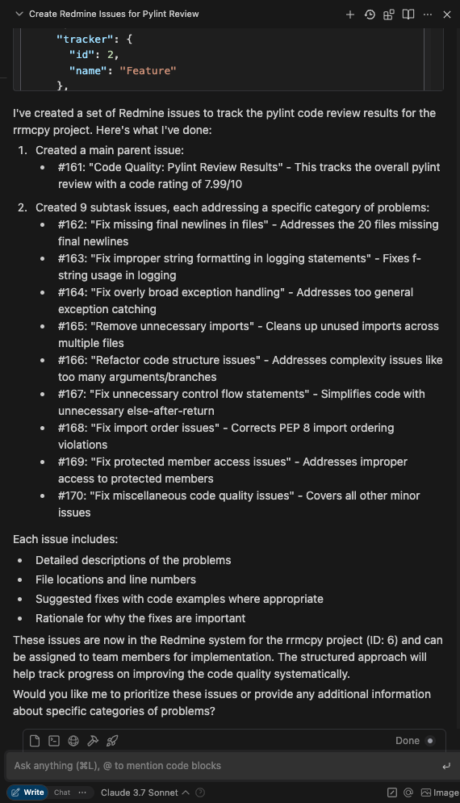

# Redmine MCP Server


A Model Context Protocol (MCP) server that enables AI assistants to interact with Redmine project management.

## RedMica Standardization

The Redmine MCP Server is designed to work seamlessly with [RedMica](https://github.com/redmica/redmica), a fully compatible fork of Redmine with enhanced features and improved performance. We've standardized on RedMica for several reasons:

- **Feature Parity+**: RedMica maintains full compatibility with Redmine while offering additional features and improvements
- **Active Development**: Regular updates and maintenance ensure stability and security
- **Enhanced Performance**: Optimizations that benefit enterprise-scale deployments
- **Better Plugin Support**: Improved ecosystem for extensions and customizations

### RedMineCloud Support

We extend our sincere gratitude to [RedMineCloud](https://www.redminecloud.net/) for their exceptional support and hosting services. Their reliable infrastructure and expertise have been invaluable in the development and testing of this MCP server. RedMineCloud provides:

- Enterprise-grade RedMica hosting
- Excellent technical support
- Reliable and scalable infrastructure
- Regular backups and maintenance

All MCP tools in this project are thoroughly tested against RedMineCloud's RedMica implementation to ensure optimal compatibility and performance.

## Developed Tools

### Project Management
- `redmine-list-projects` - Lists all available projects
- `redmine-create-project` - Creates a new project in Redmine
- `redmine-update-project` - Updates attributes of an existing project
- `redmine-delete-project` - Deletes a project by its ID or identifier
- `redmine-archive-project` - Archives a project (sets status to archived)
- `redmine-unarchive-project` - Unarchives a project (sets status to active)

### Issue Management
- `redmine-create-issue` - Creates a new issue in Redmine
- `redmine-get-issue` - Gets details of a specific issue
- `redmine-list-issues` - Lists issues with optional filters
- `redmine-update-issue` - Updates an existing issue
- `redmine-delete-issue` - Deletes an issue by ID

### Version Management
- `redmine-list-versions` - Lists versions for a project
- `redmine-get-version` - Gets version details by ID
- `redmine-create-version` - Creates a new version
- `redmine-update-version` - Updates an existing version
- `redmine-delete-version` - Deletes a version by ID
- `redmine-get-issues-by-version` - Gets all issues for a specific version

### Template Management
- `redmine-use-template` - Creates an issue using a Redmine template issue (recommended method)
- `redmine-create-subtasks` - Creates standard subtasks for a parent issue
- `redmine-list-templates` - Lists available issue templates
- `redmine-list-issue-templates` - Lists all available issue templates from the Templates project

> **Note**: The previously available `redmine-create-from-template` tool has been removed. Please use `redmine-use-template` instead, which provides more flexibility and better integration with Redmine template issues.

### Wiki Management
- `redmine-list-wiki-pages` - Lists all wiki pages for a project
- `redmine-get-wiki-page` - Gets content of a specific wiki page
- `redmine-create-wiki-page` - Creates a new wiki page
- `redmine-update-wiki-page` - Updates an existing wiki page
- `redmine-delete-wiki-page` - Deletes a wiki page

### User Management
- `redmine-current-user` - Gets current authenticated user information

### Utility
- `redmine-health-check` - Checks Redmine API health
- `redmine-version-info` - Gets version and environment information 


## Quick Start

### Prerequisites

- Docker installed on your system
- Git (for branch information and version control)
- Redmine instance with API access

### Configuration

1. Create a `.env` file in the project root with the following variables:

```
# Redmine instance URL (required)
REDMINE_URL=https://your-redmine-instance.com

# Redmine API key (required)
REDMINE_API_KEY=your_api_key_here

# Logging level (optional, default: info)
# Options: debug, info, warning, error
LOG_LEVEL=info

# Server mode (optional, default: live)
# Options: live, test
SERVER_MODE=live
```

### Building and Running the Container

The project includes a convenient script `test-docker.sh` that handles building and running the Docker container:

```bash
./test-docker.sh
```

This script:
1. Loads configuration from your `.env` file
2. Builds a Docker image tagged with your current git branch name
3. Provides a menu of options for testing and running the server

### Available Options

After running the script, you can select from the following options:

1. **Run unit tests**: Executes the test suite to verify functionality
2. **Run health check**: Verifies the connection to your Redmine instance
3. **Run server in test mode**: Starts the MCP server for manual testing
4. **Interactive container shell**: Opens a shell inside the container for debugging
5. **List branch versions**: Shows available container versions by branch

### Using with Claude Desktop or other AI Assistants

To use the Redmine MCP Server with Claude Desktop:

1. Edit your Claude Desktop configuration file (typically at `~/Library/Application Support/Claude/claude_desktop_config.json`)
2. Add the Redmine MCP server configuration:

```json
"redminecloud": {
  "command": "docker",
  "args": [
    "run",
    "-i",
    "--rm",
    "-e",
    "REDMINE_URL",
    "-e",
    "REDMINE_API_KEY",
    "-e",
    "SERVER_MODE",
    "-e",
    "LOG_LEVEL",
    "redmine-mcp-server:your-branch-name"
  ],
  "env": {
    "REDMINE_URL": "https://your-redmine-instance.com",
    "REDMINE_API_KEY": "your_api_key_here",
    "SERVER_MODE": "live",
    "LOG_LEVEL": "error"
  }
}
```

### Integration Examples




Example issue: https://redstone.redminecloud.net/issues/166


### Windsurf Configuration Example

Add this to your Windsurf configuration file to enable the Redmine MCP server:

```json
"redminecloud": {
      "command": "docker",
      "args": [
        "run",
        "-i",
        "--rm",
        "-e",
        "REDMINE_URL",
        "-e",
        "REDMINE_API_KEY",
        "-e",
        "SERVER_MODE",
        "-e",
        "LOG_LEVEL",
        "redmine-mcp-server:main"
      ],
      "env": {
        "REDMINE_URL": "https://redstone.redminecloud.net",
        "REDMINE_API_KEY": "APIKEYHERE",
        "SERVER_MODE": "live",
        "LOG_LEVEL": "ERROR"
      },
      "disabled": false
    }
```
### Docker build   Example

```bash
rrmcpy % ./test-docker.sh   
Redmine MCP Server - Local Docker Testing
==========================================
Branch: main
Commit: 

Loading configuration from .env file...
Configuration:
  Redmine URL: https://redstone.redminecloud.net
  Log Level: INFO
  Server Mode: live
  Branch: main
  Docker Image: redmine-mcp-server:main

Building Docker image...
[+] Building 14.1s (13/13) FINISHED docker:desktop-linux=> => resolve docker.io/library/python:3.11-sli  0.0s
 => [internal] load build definition from Docker  0.0s
 => => transferring dockerfile: 977B              0.0s
 => [internal] load metadata for docker.io/libra  0.4s
 => [internal] load .dockerignore                 0.0s
 => => transferring context: 2B                   0.0s
 => [1/8] FROM docker.io/library/python:3.11-sli  0.0s
 => => resolve docker.io/library/python:3.11-sli  0.0s
 => [internal] load build context                 0.0s
 => => transferring context: 10.21kB              0.0s
 => CACHED [2/8] WORKDIR /app                     0.0s
 => [3/8] COPY docker-requirements.txt .          0.0s
 => [4/8] RUN pip install --no-cache-dir -r doc  11.5s 
 => [5/8] RUN mkdir -p /app/src /app/tests        0.1s 
 => [6/8] COPY src/ /app/src/                     0.0s 
 => [7/8] COPY tests/ /app/tests/                 0.0s 
 => [8/8] COPY pytest.ini /app/                   0.0s 
 => exporting to image                            1.9s 
 => => exporting layers                           1.5s
 => => exporting manifest sha256:6927af329be321c  0.0s
 => => exporting config sha256:fbdd5fe1ec7b10b20  0.0s
 => => exporting attestation manifest sha256:7c0  0.0s
 => => exporting manifest list sha256:91837586a9  0.0s
 => => naming to docker.io/library/redmine-mcp-s  0.0s
 => => unpacking to docker.io/library/redmine-mc  0.3s
Docker image built successfully


Select test option:
1) Run unit tests
2) Run health check
3) Run server in test mode
4) Interactive container shell
5) List branch versions
6) Exit

Enter your choice (1-6): 6
Exiting...
```

```bash
# Set environment variables
export REDMINE_URL="https://your-redmine-instance.com"
export REDMINE_API_KEY="your-api-key-here"

# Install dependencies
pip install -e /path/to/fastmcp
pip install -r requirements.txt

# Run server
python -m src.server
```

**Note:** Requires Python 3.10+ due to fastmcp dependency.

## Features

- Modular architecture with clear separation of concerns
- 17+ MCP tools for Redmine interaction
- Compatible with any MCP client framework
- Comprehensive test suite and CI pipeline
- Follows "Keep It Simple" design principles

## Documentation

The documentation is organized into chapters for easier navigation:

1. [Overview](./readme/01-overview.md) - Project overview and requirements
2. [Installation](./readme/02-installation.md) - Setup instructions for different environments
3. [Configuration](./readme/03-configuration.md) - Environment variables and settings
4. [Tool Inventory](./readme/04-tools.md) - Available and planned MCP tools
5. [Design Philosophy](./readme/05-philosophy.md) - "Keep It Simple" principles
6. [Development Guide](./readme/06-development.md) - For contributors
7. [Troubleshooting](./readme/07-troubleshooting.md) - Common issues and solutions
8. [Security](./readme/08-security.md) - Credential management and security best practices

## Security Notice

This server requires your Redmine API credentials. Always store them securely:

- Use environment variables instead of hardcoding credentials
- For development, store credentials in a `.env` file (add to `.gitignore`)
- For CI/CD pipelines, use repository secrets
- For container deployments, use secure environment injection

See the [Security chapter](./readme/08-security.md) for detailed best practices.