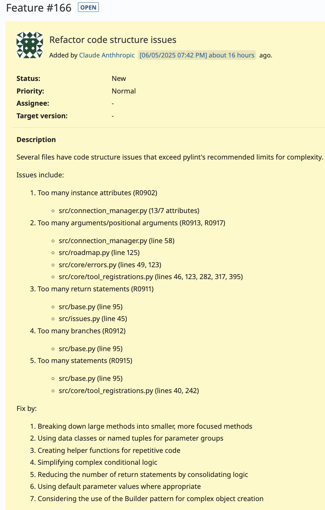

# Redmine MCP Server


A Model Context Protocol (MCP) server that enables AI assistants to interact with Redmine project management.

## Quick Start


https://redstone.redminecloud.net/issues/166



### Windsurf Configuration Example

Add this to your Windsurf configuration file to enable the Redmine MCP server:

```json
"redminecloud": {
      "command": "docker",
      "args": [
        "run",
        "-i",
        "--rm",
        "-e",
        "REDMINE_URL",
        "-e",
        "REDMINE_API_KEY",
        "-e",
        "SERVER_MODE",
        "-e",
        "LOG_LEVEL",
        "redmine-mcp-server:main"
      ],
      "env": {
        "REDMINE_URL": "https://redstone.redminecloud.net",
        "REDMINE_API_KEY": "APIKEYHERE",
        "SERVER_MODE": "live",
        "LOG_LEVEL": "ERROR"
      },
      "disabled": false
    }
```

```bash
rrmcpy % ./test-docker.sh   
Redmine MCP Server - Local Docker Testing
==========================================
Branch: fix/issue155-update-issue-tracker-support
Commit: 4c6653b

Loading configuration from .env file...
Configuration:
  Redmine URL: https://redstone.redminecloud.net
  Log Level: INFO
  Server Mode: live
  Branch: main
  Docker Image: redmine-mcp-server:main

Building Docker image...
[+] Building 14.1s (13/13) FINISHED docker:desktop-linux=> => resolve docker.io/library/python:3.11-sli  0.0s
 => [internal] load build definition from Docker  0.0s
 => => transferring dockerfile: 977B              0.0s
 => [internal] load metadata for docker.io/libra  0.4s
 => [internal] load .dockerignore                 0.0s
 => => transferring context: 2B                   0.0s
 => [1/8] FROM docker.io/library/python:3.11-sli  0.0s
 => => resolve docker.io/library/python:3.11-sli  0.0s
 => [internal] load build context                 0.0s
 => => transferring context: 10.21kB              0.0s
 => CACHED [2/8] WORKDIR /app                     0.0s
 => [3/8] COPY docker-requirements.txt .          0.0s
 => [4/8] RUN pip install --no-cache-dir -r doc  11.5s 
 => [5/8] RUN mkdir -p /app/src /app/tests        0.1s 
 => [6/8] COPY src/ /app/src/                     0.0s 
 => [7/8] COPY tests/ /app/tests/                 0.0s 
 => [8/8] COPY pytest.ini /app/                   0.0s 
 => exporting to image                            1.9s 
 => => exporting layers                           1.5s
 => => exporting manifest sha256:6927af329be321c  0.0s
 => => exporting config sha256:fbdd5fe1ec7b10b20  0.0s
 => => exporting attestation manifest sha256:7c0  0.0s
 => => exporting manifest list sha256:91837586a9  0.0s
 => => naming to docker.io/library/redmine-mcp-s  0.0s
 => => unpacking to docker.io/library/redmine-mc  0.3s
Docker image built successfully


Select test option:
1) Run unit tests
2) Run health check
3) Run server in test mode
4) Interactive container shell
5) List branch versions
6) Exit

Enter your choice (1-6): 6
Exiting...
```

```bash
# Set environment variables
export REDMINE_URL="https://your-redmine-instance.com"
export REDMINE_API_KEY="your-api-key-here"

# Install dependencies
pip install -e /path/to/fastmcp
pip install -r requirements.txt

# Run server
python -m src.server
```

**Note:** Requires Python 3.10+ due to fastmcp dependency.

## Features

- Modular architecture with clear separation of concerns
- 17+ MCP tools for Redmine interaction
- Compatible with any MCP client framework
- Comprehensive test suite and CI pipeline
- Follows "Keep It Simple" design principles

## Documentation

The documentation is organized into chapters for easier navigation:

1. [Overview](./readme/01-overview.md) - Project overview and requirements
2. [Installation](./readme/02-installation.md) - Setup instructions for different environments
3. [Configuration](./readme/03-configuration.md) - Environment variables and settings
4. [Tool Inventory](./readme/04-tools.md) - Available and planned MCP tools
5. [Design Philosophy](./readme/05-philosophy.md) - "Keep It Simple" principles
6. [Development Guide](./readme/06-development.md) - For contributors
7. [Troubleshooting](./readme/07-troubleshooting.md) - Common issues and solutions
8. [Security](./readme/08-security.md) - Credential management and security best practices

## Security Notice

This server requires your Redmine API credentials. Always store them securely:

- Use environment variables instead of hardcoding credentials
- For development, store credentials in a `.env` file (add to `.gitignore`)
- For CI/CD pipelines, use repository secrets
- For container deployments, use secure environment injection

See the [Security chapter](./readme/08-security.md) for detailed best practices.